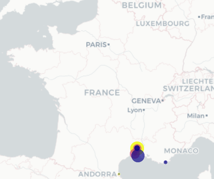

# Kayak project

This project was created for a bootcamp in Data Science. The main idea is to simulate a service like kayak
#scrapy #

# Description

The tasks to achieve the project's goal are:

- Retrieve weather data for the next 7 days and coordinates data of 35 cities in France, using 2 **API**
- **Scrap** booking.com to retrieve a list of hotels for the cities.
- Identify the top 5 cities with the best weather in the next 7 days
- Display on a **map** the cities with the best weather and show the best hotels to stay in
- Store extracted data in S3 from **AWS** and save the files retrieved from APIs and the scrapping (data lake)
- Transform and load cleaned data from the data lake to a data warehose in **postgreSQL** database in **AWS** 


# Folders

## notebooks/

### 01-weather.ipynb

Code to retrieve the weather data and coordinates from France cities
France map containing the warmest cities in the next 7 days



### 02-booking-crawler-one-city.ipynb

Code that calls a python spider to scrap booking.com for one city

### 03-booking-crawler-all.ipynb

Same as the notebook above, but running the scrapper for 33 cities in France


## kayak/

Contains the .py files for the spider. I use scrapy's CrawlSpider. The crawler can be found in the directory spiders<br>
The spider can be launched also in a command command line, going first to the root directory 03-kayak: <br>

```
 scrapy crawl bookingspy
```

<br>

## s3/

### 03-botoS3.ipynb

The files retrieved from API calls and scrapping were saved in aws S3<br>
ETL: 2 tables were created (city and hotel) in AWS RDS. Data from scrapped files was processed save in the database using SQLAlchemy

